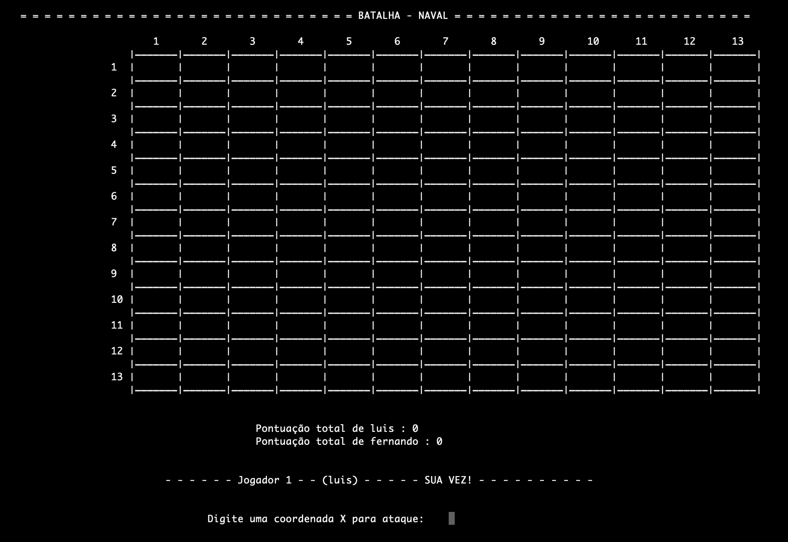

Batalha Naval - EP1 Orientado a Objetos 2019
===

Batalha naval foi um jogo desenvolvido em c++ com o intuito de aprender orientação objetos. 
---
Todo o jogo é executado no terminal, mas conta com uma interface intuitiva de fácil entendimento.
----

* Esta é a janela principal do programa

* O jogo conta com **dois modos diferentes**.

O **primeiro** é posicionando embarcações para cada jogador com seu respectivo documento em que já possui as coordenadas em txt. 

O **segundo** modo é posicionando as embarcações dinamicamente.

* O jogo conta com a opção de escolher 3 tamanhos diferentes para mapas.

* O jogo conta também com um **menu de instruções** para auxiliar no entendimento do jogo e melhora da experiência do usuário.

Dados do ambiente de desenvolvimento
---
* Sistema Operacional de desenvolvimento: iOS.

Compilado com g++ configurado com makefile

Comandos para ser compilado após baixado:
No diretório onde se encontra devem ser executados os seguintes comandos na respectiva ordem:

* make clean
* make
* make run

Log de versão do compilador:

Configured with: --prefix=/Applications/Xcode.app/Contents/Developer/usr --with-gxx-include-dir=/Applications/Xcode.app/Contents/Developer/Platforms/MacOSX.platform/Developer/SDKs/MacOSX10.14.sdk/usr/include/c++/4.2.1
Apple LLVM version 10.0.0 (clang-1000.11.45.5)
Target: x86_64-apple-darwin18.2.0
Thread model: posix
InstalledDir: /Applications/Xcode.app/Contents/Developer/Toolchains/XcodeDefault.xctoolchain/usr/bin
